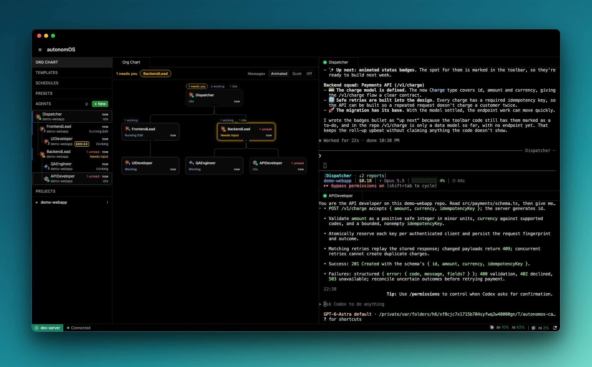

<div align="center">

# autonomOS

**Multi-agent harness for CLI coding agents — orchestrate Claude Code, Codex, and more.**

**[autonomos.terrylu.cloud](https://autonomos.terrylu.cloud)**

[](https://github.com/aterrylu/autonomOS/actions/workflows/test.yml)
[](https://github.com/aterrylu/autonomOS/releases/latest)
[](LICENSE)
[](https://github.com/aterrylu/autonomOS/commits/main)
[](https://github.com/aterrylu/autonomOS/stargazers)
[](CONTRIBUTING.md)




</div>

## Why autonomOS

Running several coding-CLI agents today means a grid of terminal tabs you babysit — copy-pasting context between them, relaying every hand-off by hand. autonomOS turns them into a **team**: one shared message bus, one shared MCP toolbelt, and an org chart of who reports to whom, so agents coordinate *directly* across whichever CLI they run.

- **A message bus for coding agents** — a URI gateway (`agent://reviewer`) routes messages between running sessions, and tells the sender whether the message actually landed; a Claude Code agent hands off to a Codex one with no human relay.
- **Cross-CLI by design** — Claude Code, Codex, and Gemini share one MCP toolbelt and one address space, so orchestration is written once and works across every runtime.
- **An org chart, like a company** — agents organize into managers and reports; work delegates *down* the tree and escalates *up* it, on a hierarchy you shape at runtime — not a flat pool of tabs.
- **Coordination you can watch** — normalized hook telemetry streams every agent's live status as they work and message each other.
- **Browser-native and always-on** — it runs as a self-hosted daemon, so the fleet is reachable from any browser or PWA and keeps working after you close your laptop. (The hosting is a byproduct; the orchestration is the point.)

## Install

One line — installs the server as an OS-native daemon and prints your dashboard URL:

```bash
curl -fsSL https://autonomos.terrylu.cloud/install.sh | bash
```

This detects your OS, drops a pre-built server bundle in `~/.local/share/autonomos/`, registers a launchd (macOS) or systemd-user (Linux) service, runs a smoke test, and hands you a `http://localhost:3100/?token=…` link. Requires **Node 20+**.

Manage it anytime with the `autonomos` CLI:

```bash
autonomos status        # is the daemon healthy?
autonomos logs -f       # follow the server log
autonomos restart       # bounce the service
autonomos stop          # stop it (stays down until you start it)
```

> **Deploy to a remote box** you own (a homelab server, a VPS): clone the repo and run
> `make deploy DEPLOY_HOST=your-host` — it rsyncs, builds, and supervises the server there
> via systemd-user. Now your agents live on hardware that's *always* on.

## Coding-CLI support

autonomOS is CLI-agnostic by design: every runtime plugs into the same message bus and the same MCP toolbelt, so coordination is written once and works across all of them. **Claude Code and Codex are fully supported; Gemini is partial.**

| Capability | Claude Code | Codex | Gemini |
|---|:---:|:---:|:---:|
| Spawn as a managed session | ✅ | ✅ *(daemon + remote TUI)* | ✅ |
| Live status telemetry | ✅ hooks | ✅ event stream | ✅ hooks *(translated)* |
| Shared MCP toolbelt | ✅ | ✅ | ✅ |
| **Send** to other agents | ✅ | ✅ | ✅ |
| **Receive** from other agents | ✅ | ✅ *native, inline* | ❌ not yet |
| Permission modes | ✅ | ✅ | ✅ |
| Usage / token tracking | ✅ | ✅ | ❌ not yet |
| Resume across restarts | ✅ | ✅ | ⚠️ fresh session |

**How it works.** Two pieces make cross-CLI coordination possible. The **message bus** is a URI router: address any agent as `agent://name` and the gateway delivers to the right session, acknowledging the send only once the destination has accepted it — hiding a per-runtime delivery path (Claude Code and Gemini over a WebSocket channel; Codex injected into its `app-server` daemon so messages render *inline* in the live TUI) behind one uniform address space. The **shared MCP** is a single set of tools — `create_agent`, `send`, `set_manager`, `get_org_chart`, schedules — injected into every agent in its provider-native way, so a Claude Code agent and a Codex agent call the *same* `send()` with identical schemas. Adding a runtime is implementing one provider interface, not re-plumbing the bus.

## What's inside

|  |  |
|---|---|
| **Split-pane terminals** | Multiple agent sessions side by side — drag-to-split, tabs, keyboard shortcuts. |
| **Live agent status** | Working / idle / needs-input / error, derived from hook telemetry, with unread notification badges. |
| **Org chart** | A hierarchy view of managers and reports — see who delegated what to whom. |
| **Multi-agent messaging** | URI-based gateway (`agent://name`) with delivery-confirmed sends, plus MCP tools to spawn, message, and organize agents. |
| **Cron scheduler** | Native timer-based scheduling — agents create their own recurring or one-time jobs; the dashboard monitors them. |
| **Session management** | Create, resume, kill, auto-reconnect, output replay, and auto-persist across server restarts. |
| **PWA + themes** | Installable as a standalone app with notifications. Midnight, Daylight, and Void themes. |

## Develop from source

```bash
git clone https://github.com/aterrylu/autonomOS && cd autonomOS
cp -n .env.example .env   # optional config
bun install

make dev                  # API on :3101 + Vite HMR on :5173
make prod                 # build + install the daemon on :3100
make check                # lint (Biome) + typecheck + tests
make down                 # remove the service + free dev ports
```

<details>
<summary>All make targets</summary>

| Target | Description |
|--------|-------------|
| `make dev` | API server (watch, :3101) + Vite HMR (:5173) |
| `make prod` | Build dashboard + (re)install launchd/systemd-user daemon on :3100 |
| `make deploy` | Rsync to remote + `make prod` (set `DEPLOY_HOST` in `.env`) |
| `make check` | Lint + typecheck + server & CLI tests |
| `make fmt` | Auto-fix lint + formatting |
| `make stop` / `make restart` | Stop / restart the daemon via the supervisor |
| `make logs` | Tail the server log (`~/.autonomos/logs/autonomos.log`) |
| `make down` | Remove the service + kill dev ports |
| `make hero` | Regenerate the README hero screenshot (`docs/assets/hero.png`) — re-run after dashboard UI changes |

`make prod` supervises the server with the **OS-native init system** — launchd on macOS,
systemd-user on Linux — not pm2. It auto-migrates an existing pm2-managed `autonomos` on
first run (`NO_MIGRATE=1` to skip).

</details>

### Authentication

Auth is always on — there's no way to disable it. On first start the server generates a random
token, stores it at `~/.autonomos/token`, and prints it at install time; the dashboard shows a
login page and every API, WebSocket, and MCP route requires it. Set `AUTONOMOS_TOKEN` to pin
your own instead of the generated one.

## Architecture

```
Dashboard (React)          Server (Hono + node-pty)
┌─────────────┐           ┌──────────────────────┐
│ xterm.js    │◄──ws──────│ PTY sessions         │
│ Split panes │           │ Hook relay           │
│ Org chart   │◄──poll────│ Agent status machine │
│ Schedules   │           │ MCP server (HTTP)    │
│ Status bar  │           │ Gateway router       │
└─────────────┘           │ Cron scheduler       │
                          └──────────────────────┘
```

Spawned sessions get a hook relay (inline `curl` on all 13 Claude Code events) that streams
telemetry back to the server's status state machine, and an injected system prompt that gives
each agent its identity, its teammates, and MCP tools to coordinate. See
[docs/FEATURES.md](docs/FEATURES.md) and [docs/DECISIONS.md](docs/DECISIONS.md) for the full design.

## Tech stack

**Frontend** React 19 · Zustand 5 · Tailwind 4 · xterm.js 6 · framer-motion
**Backend** Hono · node-pty · Claude Agent SDK · MCP SDK
**Tooling** Bun · Biome · launchd / systemd-user supervision · TypeScript project references

## Docs

- [FEATURES.md](docs/FEATURES.md) — feature specifications and design intent
- [ROADMAP.md](docs/ROADMAP.md) — what's done, what's next
- [DECISIONS.md](docs/DECISIONS.md) — architectural decision records
- [VISION.md](docs/VISION.md) — where this is headed
- [RESEARCH.md](docs/RESEARCH.md) — competitor analysis and research

## Contributing

Issues and PRs welcome — see [CONTRIBUTING.md](CONTRIBUTING.md) to get started.

## License

MIT — see [LICENSE](LICENSE).

## Trademarks

autonomOS displays third-party provider logos (Claude, OpenAI Codex, Google Gemini) solely to
identify which runtime backs an agent. All product names, logos, and brands are the property of
their respective owners; their use is nominative and does not imply affiliation or endorsement.
See [NOTICE](NOTICE).
