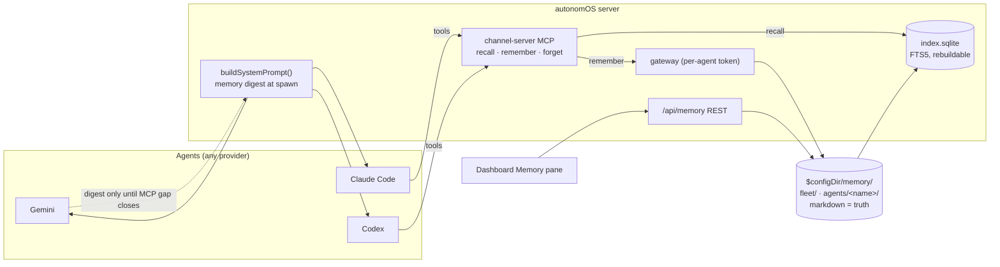

# Agent memory for autonomOS — evaluation (2026-09-11)

**Status:** decision-ready, nothing built. **Update 2026-09-12:** Terry locked scope (fleet + per-agent), storage (`$configDir/memory`) and direct attributed writes, and replaced the Phase 0 bridge with a coexistence question — see [`coexistence.md`](coexistence.md), which recommends redirecting Claude Code's native memory into our store (option A1) and adds a `projects/<project>/` scope. Commissioned by Terry ("a memory system where all or each agents have access to; our custom system, or some OSS or paid agent memory system"). Companion files: [`landscape.md`](landscape.md) (per-system facts with sources) and [`hands-on.md`](hands-on.md) (spikes run in an isolated scratchpad against Terry's real memory corpus).

**One-paragraph answer.** Build the custom path: a markdown-first memory store under `$configDir/memory/` with two scopes (per-agent by *name*, and fleet-shared), indexed by SQLite FTS5, exposed through two or three MCP tools on the channel server that already exists, and injected as a digest at spawn through the one system-prompt chokepoint all three providers share. Do not adopt a memory platform. Every platform's differentiator is LLM extraction on write, which our spikes show is the expensive and fragile part (paraphrase, duplicates, missed contradictions) and which our agents already do better themselves at write time. Retrieval, the part a platform would make easy, is a solved ~120-line problem at our corpus size: plain keyword search hit the right file in the top 3 on 8 of 8 realistic queries over Terry's 134 existing memory files. The cheapest first step needs no new store at all: bridge Claude Code's existing per-repo memory to Codex and Gemini agents read-only, and put it on the dashboard.

---

## 1. Problem shape

"Memory" is three different things here, and only one of them is missing.

| Layer | What it means | Exists today? |
|---|---|---|
| **A. Episodic continuity** — "what was I doing" across a restart | Transcript resume | **Yes, all three providers.** `--resume` via `providerSessionId`, `codex resume`, `gemini --resume`; ADR-049 dev-restart parity. Transcript ≠ memory, but continuity is covered. |
| **B. Per-agent durable memory** — facts, preferences and lessons keyed to *who the agent is* (ReleaseRollout@autonomOS), surviving a fresh session, not just a resume | Identity-keyed store | **No.** Claude Code's auto-memory is keyed by **git repo**, Codex's by **user**, Gemini's by **project**. No provider keys memory by agent name, and none is readable by the other two. |
| **C. Fleet-shared knowledge** — standing rules, decisions, runbooks, lessons | Shared store | **Partly, organically.** `CLAUDE.md` (~7.8k tokens, every session), `docs/DECISIONS.md` (96 ADRs, 463 KB, grep-only), `docs/RESEARCH.md`, TeamLead relaying Terry's rulings, and Claude Code's auto-memory dir, which has quietly become the real fleet memory for Claude Code agents. |

### What exists organically (measured, see [hands-on §1](hands-on.md#1-the-organic-corpus-what-claude-code-already-wrote))

Claude Code's auto-memory for this repo, `~/.claude/projects/-Users-aterrylu-workspace-autonomOS/memory/`, holds **134 fact files (704 KB), written by 44 distinct sessions**, typed `project` (75) / `feedback` (58) / `reference` (1), with a 129-line `MEMORY.md` index (~4.8k tokens) loaded into every Claude Code session. Because the directory is keyed by git repo (worktrees share it since Claude Code 2.1.63) and every autonomOS agent in this repo runs with the same cwd, **every Claude Code agent in the fleet already reads and writes one shared memory.** During this evaluation the index changed on disk mid-session: another running agent appended a line. Five topic files are not in the index (drift), there is no locking, and attribution is a session UUID, not an agent name.

That is the honest baseline: a working, heavily used, fleet-shared memory that is (1) Claude-Code-only, (2) repo-keyed rather than agent-keyed, (3) uncoordinated, and (4) invisible to the dashboard.

### What is missing, in priority order

1. **Provider neutrality.** Codex and Gemini agents cannot read or write any of the 134 files. Codex has its own background-generated memory (off by default, "don't hand-edit"); Gemini's `save_memory` tool was removed in 0.40.0 and its auto-memory is an experimental inbox. Neither is a substitute.
2. **Identity-keyed scope.** A long-lived role agent (ReleaseRollout, Shortcuts) has no place to keep *its* standing state that survives a kill + `create_agent(resumeSessionId)` or a server restart. Today it borrows the repo-wide dir, so every agent's index carries every other agent's role state (context tax) and "I" in a memory file is ambiguous.
3. **Observability and curation.** No dashboard view (`ROADMAP.md` has "Memory state viewer" in Later). Terry cannot see what agents believe, correct a stale fact, or delete a wrong one without opening files.
4. **Integrity.** Concurrent writers, index drift, no provenance beyond a session id, no staleness signal beyond a `modified` timestamp. The prompt rule "if a memory names a file or flag, verify it still exists" is the current mitigation.
5. **Cross-machine.** Memory is local to `~/.claude` on the box (laptop vs forge).

Two things are explicitly **not** the problem: retrieval quality at this scale (see hands-on §2), and ADR storage (`DECISIONS.md` stays canonical; memory is operational, not architectural).

---

## 2. Landscape summary

Full profiles with sources in [`landscape.md`](landscape.md). The hard constraint is provider-neutral access from Claude Code, Codex and Gemini, which in practice means MCP (all three speak stdio and streamable HTTP) or system-prompt injection.

| Option | License | Fully local? | Provider-neutral MCP | LLM call per write | Fit tag | Verdict |
|---|---|---|---|---|---|---|
| **mem0** OSS | Apache-2.0 | yes (verified with Ollama) | no — MCP is hosted-platform only; we'd write a shim | 1 (v2 single-pass, ADD-only) | Overkill; graph moved to paid | Reject |
| **Zep / Graphiti** | Apache-2.0 / hosted | Graphiti yes (+ graph DB) | Graphiti ships a self-hostable MCP server | several per episode | Strongest temporal "what superseded what" model; Python + graph DB | Reject for now; revisit only if graph queries are wanted |
| **Supermemory** | MIT + a 10k-doc licence cap on the self-host binary | mostly (local binary, local ONNX embeddings, needs an LLM) | MCP hosted-only; local has Claude Code + Codex plugins, no Gemini | 1 ("dreaming") | Lightest platform footprint; licence ambiguity | Reject |
| **Letta** | Apache-2.0 | agent memory yes; **shared memory is cloud-only** | none first-party | agent-driven + dreaming | It is an agent *runtime*; Python server EOL (confirmed hands-on) | Reject |
| **cognee** | Apache-2.0 | **yes** (Kuzu + LanceDB + SQLite in-process) | **yes, official, local** (`remember`/`recall`/`forget`) | graph extraction per write | The one platform that clears every hard constraint; Python, document-centric, heavy per write | Best "buy" option; still not recommended for v1 |
| **Honcho** | **AGPL-3.0** | yes, 5 compose services | yes (~35 tools) | ingestion + per-question Dialectic | People-modeling infra | Reject |
| **Memori** | Apache-2.0 | **no** — augmentation round-trips to their API | hosted only | remote | Cloud dependency contradicts the pitch | Reject |
| **LangGraph store / langmem** | MIT | yes | n/a (library) | langmem yes | Python-only persistence; JS has `InMemoryStore` only | Not applicable to a Bun server |
| **LlamaIndex memory** | MIT | yes | n/a | fact-extraction block yes | **LlamaIndexTS archived 2026-04-30** | Not applicable |
| **basic-memory** | **AGPL-3.0** | yes (downloads an ONNX model) | yes, 23 tools | no | Closest OSS to the custom path; AGPL + Python runtime + 23 tools per agent | Pattern source, not a dependency |
| **Engram** (Go) | MIT | yes (SQLite + FTS5) | yes; writes MCP config + protocol into CLAUDE.md/AGENTS.md/GEMINI.md | no | "One binary, three CLIs"; rows not files | Pattern source |
| **OpenClaw memory** | MIT | yes | tools inside OpenClaw | no | MEMORY.md + dated markdown + FTS5/sqlite-vec hybrid + MMR; per-agent, no sharing by design | **The reference design** for the custom path (already in `docs/research/openclaw/`) |
| **Claude Code auto-memory** | — | yes | Claude Code only | no | What we already have; `autoMemoryDirectory` is settable per spawn | **Baseline and Phase 0 lever** |
| **Custom** (markdown + FTS5 + MCP in the channel server) | ours | yes | yes, by construction | no (agent writes verbatim) | ~2 weeks; zero external services | **Recommended** |

### Cross-cutting findings that drove the verdicts

- **Extraction is the product, and extraction is the problem.** mem0 with a local 7B model rewrote "Never bind :3100" into "User advises against binding…", stored the squash-merge rule twice, and filed a contradiction as a new fact instead of an update ([hands-on §3](hands-on.md#3-mem0-oss-v2020-fully-local)). A frontier model does better, at an API call and a cloud round-trip per `remember`. For rules whose exact wording is load-bearing, verbatim agent-written facts (what Claude Code does today) are strictly better.
- **Retrieval is cheap.** FTS5 over `name + description + body` of the real corpus: top-3 hit rate 8/8, query 37 ms, index 300 KB. Local embeddings (nomic-embed-text via Ollama) lift top-1 from 6/8 to 8/8 for 3 s of indexing and 3.7 MB ([hands-on §2](hands-on.md#2-custom-path-sqlite-vec--fts5-hybrid-over-the-real-corpus)). Embeddings are an upgrade behind the same `recall` tool, not a v1 dependency.
- **The 2025–26 trend is paywalling the clever bits.** mem0 removed graph memory from OSS in v2.0.0; Zep retired Community Edition; Supermemory's self-host carries a document cap; Letta's shared memory requires Letta Cloud; Memori's extraction is hosted even in bring-your-own-DB mode. Building on a platform's OSS tier is building on a moving floor.
- **Every extra tool is an approval prompt** for Codex (`default_tools_approval_mode`) and Gemini (`trust`/`includeTools`) unless pre-approved, which argues for 2–3 tools, not basic-memory's 23 or Honcho's 35. `readOnlyHint` on `recall` rides ADR-085's existing pre-approval.
- **Gemini CLI itself is a moving target**: Google retired it for consumer tiers on 2026-06-18 in favor of Antigravity CLI (same `~/.gemini/` tree). Anything Gemini-specific should be minimal.

---

## 3. Fit analysis against the actual architecture

The codebase survey (read-only, `main` at 94df064) found exactly where a memory feature would plug in. Line references are current as of that commit.

### Seams that make the custom path cheap

| Seam | Where | Why it matters |
|---|---|---|
| **One system-prompt chokepoint** | `buildSystemPrompt()` in `providers/shared.ts` — Claude Code `--append-system-prompt`, Codex `-c instructions=` on the daemon, Gemini prepend-to-prompt | A memory digest added here reaches **all three providers identically**, including Gemini, which cannot reach MCP tools at all today. |
| **Existing per-agent MCP subprocess** | `channel-server/index.ts` switch; `mcp/tools.ts` `ToolDef` with `readOnlyHint` | `remember`/`recall` are two `case` arms plus two `ToolDef`s. The channel server already knows its `AUTONOMOS_SESSION_ID` and holds the per-agent token. |
| **Per-agent identity, verified** | `agentCredentials.ts`; gateway `register` in `routes/gateway.ts`; hook ingest in `routes/hooks.ts` | A gateway-routed `remember` is attributable to the calling agent for free, exactly like `send`. |
| **Persistence recipe** | `handoffQueue.ts` (newest, mirrors `schedules.ts`/`envPresets.ts`) | Per-call `getConfigDir()`, `SAFE_NAME_RE`, 0600 under 0700, temp+rename, shape guard, explicit corruption policy, test-isolation guard (#350). |
| **Hook relay as capture trigger** | `routes/hooks.ts` handler: `SessionEnd`, `Stop`, `PreCompact` already recognized write points | A "you are about to compact — save what matters" nudge is a message, not new plumbing. Covers Claude Code and Gemini natively; Codex via `noteAgentTurnComplete`. |
| **Claude Code settings payload** | `providers/claude-code.ts:236` builds an inline object | `autoMemoryDirectory` per agent is one added key (the installed 2.1.269 binary carries `autoMemoryDirectory`, `autoMemoryEnabled`, `CLAUDE_CODE_PROJECT_DIR_NAME`, `CLAUDE_CODE_DISABLE_AUTO_MEMORY`). |
| **Transcript reader** | `titleCache.ts` (JSONL locator, three-phase scan, mtime cache) | Reusable for a server-side capture pass, Claude Code only. |
| **Dashboard pane pattern** | `ActivePane` union in `dashboard/src/store.ts`; `PresetsPanel.tsx` as the analogue | A Memory pane is additive across three files plus one component (remember `isValidActivePane` and the two persisted pane carriers). |

### Seams that constrain it

- **Gemini does not launch the channel server in PTY mode** (verified by real-spawn QA 2026-07-28, documented in `providers/gemini-cli.ts`). A memory MCP tool is **unreachable from Gemini agents today**. Gemini gets memory only via the system-prompt digest until the CodexGemini initiative closes that gap.
- **No `systemPrompt` on the agent record.** `respawnAgent()` re-applies only the template's prompt, so any digest injected as an ad-hoc `appendSystemPrompt` vanishes on the first restart. The digest must be **derived from disk at every spawn**, not carried on the record. (This also means the digest is always fresh.)
- **REST from the channel server carries only the global token.** Every non-`send` tool uses `serverFetch` with `AUTONOMOS_TOKEN`; an agent could write to another agent's memory by lying in the body. `remember` should go over the gateway WebSocket (per-agent token verified at `register`) or add the per-agent token as a header verified server-side.
- **Four-place tool addition.** `validation.ts` (Zod source) → `mcp/tools.ts` (hand-copied JSON schema) → channel-server `case` → `mcp.ts` registration, plus the **committed `dist.mjs` rebuild** (`Makefile:74`) or the tools ship inert (the ADR-085 near-miss). The drift test, the annotation test and the instructions-sync test keep the copies honest.
- **Codex tool count and approvals.** Under `ask`/`plan` Codex runs `writes` mode: `recall` (read-only) never prompts; `remember` prompts once per session unless the mode is `approve`. Acceptable.

### Cost tags

| Path | Build cost | Run cost | External deps | Provider coverage |
|---|---|---|---|---|
| Phase 0 bridge (below) | **S** (1–2 days) | +~5k tokens per Codex/Gemini spawn if the index is injected | none | read: all three; write: Claude Code only |
| Custom store v1 | **M** (1–2 weeks incl. tests, pane, ADR) | ~37 ms per recall; zero LLM calls | none (Bun + SQLite FTS5; note the macOS `bun:sqlite` extension-loading caveat only bites if sqlite-vec is added) | read: all three (digest); tools: Claude Code + Codex until the Gemini MCP gap closes |
| Custom + local embeddings | +S | +3 s index per 135 docs; ~4 MB | Ollama daemon **or** an in-process ONNX/GGUF model (~100–300 MB download) | same |
| cognee (the best "buy") | **M** to integrate (Python service + MCP config per provider + scoping conventions) | 1+ LLM extraction call per write; local LLM or API key required | Python runtime, cognee server, LLM endpoint | tools only; no digest path unless we build one anyway |
| Any hosted platform | S to wire | per-write API cost + cloud round-trip on every remember; memory leaves the box | vendor account | tools only |

### Security posture (trusted fleet, ADR-067 wording applies)

Memory is a capability every agent in the fleet gets. An agent can write a false "rule" that other agents then follow; that is the same trust assumption env presets and `send` already make. Mitigations that fit the existing model: attribution (agent name + session id + `modified` in every file's frontmatter), fleet-scope writes visible on the dashboard, and `recall` results labelled with their author so a reader can weigh them. Secrets never belong in memory; the `RESERVED_ENV_KEYS` strip pattern has no analogue here, so the write path should reject obvious credential shapes (`sk-ant-`, `AUTONOMOS_TOKEN=`) the way the usage plugin validates cookie shapes.

---

## 4. Recommendation and phased proposal

**Recommendation: custom, markdown-first, in `$configDir/memory/`, exposed via the channel server and the system-prompt chokepoint.** Start with a zero-store bridge that answers the most urgent gap (Codex and Gemini are memory-blind) in a day.

### Phase 0 — Bridge what already exists (S, no new store) — **superseded 2026-09-12**

> Terry declined this phase: it assumes Claude Code is installed and used. Replaced by the coexistence decision in [`coexistence.md`](coexistence.md). Kept for the record.

1. **Read-only Memory pane** over Claude Code's auto-memory dir for the agent's repo (`~/.claude/projects/<slug>/memory/`), reusing `titleCache`'s `cwdToDirName`. This is the roadmap's "Memory state viewer", scoped down. Shows the index, each file, author session, `modified`, and flags orphans.
2. **Inject the `MEMORY.md` index into Codex and Gemini system prompts** at `buildSystemPrompt`, behind a setting (default on for non-Claude providers), so all three providers read the same fleet knowledge. Codex/Gemini can then `Read` the topic files directly since they run in the same cwd.
3. **Do not** move Claude Code's memory anywhere yet. The repo-shared dir is the fleet's best asset; fragmenting it per agent would lose that.

Decision needed from Terry: is cross-provider *read* of the Claude Code memory wanted, and is ~5k tokens per Codex/Gemini spawn acceptable?

### Phase 1 — Fleet memory store (M)

```
$configDir/memory/
├── fleet/                       # shared: rules, decisions-in-practice, runbooks, lessons
│   ├── MEMORY.md                # index, one line per file (same shape CC already writes)
│   └── never-bind-port-3100.md
├── agents/<agentName>/          # identity-keyed: role state, standing tasks, own lessons
│   ├── MEMORY.md
│   └── release-queue-v0-7-0.md
└── index.sqlite                 # FTS5 over name+description+body; REBUILDABLE, markdown is the truth
```

- **File shape** = Claude Code's, extended: `name`, `description`, `type: user|feedback|project|reference`, plus `scope`, `author` (agent name), `originSessionId`, `modified`, optional `expires`/`verify`. Keeping the shape means Terry's 134 existing files can be imported with a script, and Claude Code agents can keep writing in a format they already know.
- **Tools** (channel server + HTTP MCP): `recall(query, scope?)` with `readOnlyHint`; `remember(scope, name, description, type, body)` gateway-routed for attribution; `forget(scope, name)`. Three tools, verbatim content, no LLM in the loop.
- **Digest at spawn** via `buildSystemPrompt`: the agent's own index + the fleet index, derived from disk every spawn (so it survives respawn and is never stale). Budget: fleet index capped like Claude Code caps `MEMORY.md` (200 lines / 25 KB).
- **REST** `/api/memory` for the dashboard: list, read, edit, delete, reindex. Memory pane becomes read-write.
- **Persistence** follows `handoffQueue.ts` exactly. `SAFE_NAME_RE` on scope and slug; atomic writes; index rebuilt from files on boot and on write.
- **ADR** recorded before merge (scope model, verbatim-over-extraction, markdown-as-truth, trusted-fleet write policy).
- **Gemini caveat stated in the ADR:** digest only, tools unreachable until the Gemini MCP launch gap is fixed.

### Phase 2 — Capture and hygiene (M)

- **Capture nudges** on `PreCompact` and `SessionEnd`: the server sends the agent a short "save durable facts now" message (Claude Code and Gemini via hooks; Codex via `noteAgentTurnComplete`). The agent decides what to keep; the server never fabricates memories.
- **Hygiene**: orphan/index-drift lint on reindex, duplicate-slug rejection, `expires`, a `stale?` badge when a memory names a file/flag that no longer exists (the rule Claude Code's prompt already asks agents to apply by hand).
- **Optional local embeddings** behind `recall`: sqlite-vec + a small local model (Ollama if present, else in-process GGUF/ONNX). The spike says this is a top-1 precision upgrade, not a requirement, so it stays optional and off by default.
- **Import** of the existing Claude Code corpus into `fleet/` (one-time script; keeps the CC dir as-is or points `autoMemoryDirectory` at `fleet/` per agent — Terry's call).

### Phase 3 — Only if a need appears (L, optional)

- Cross-machine sync (laptop ↔ forge): git-backed memory dir (Letta's MemFS idea) or rsync in `make deploy`.
- Graph/temporal queries ("what superseded what, when"): adopt Graphiti or cognee as an *additional* index over the same markdown, never as the source of truth.



### Questions for Terry (a questionnaire round via TeamLead)

1. **Scope:** both per-agent (by name) and fleet-shared, with fleet as the default target for rules and decisions? Or fleet only for v1?
2. **Phase 0 bridge:** inject Claude Code's `MEMORY.md` index into Codex/Gemini prompts now, at ~5k tokens per spawn?
3. **Fidelity:** verbatim agent-written facts (recommended) vs LLM-extracted summaries?
4. **Retrieval:** FTS-only v1 (recommended) vs embeddings from day one (adds a local model download or an API key)?
5. **Location:** `$configDir/memory/` (recommended, dashboard-managed, provider-neutral) vs inside the repo under `docs/` (git-tracked, but repo-scoped) vs keep using Claude Code's dir and just bridge it?
6. **Curation model:** agents write directly (trusted fleet, recommended) vs a Gemini-style inbox Terry approves?
7. **Existing corpus:** import the 134 files into `fleet/` and re-point Claude Code agents there, or leave Claude Code's dir untouched and treat the new store as additive?
8. **Cross-machine:** is laptop ↔ forge memory parity a requirement, or a later concern?

If Terry answers 1–4 with the recommended options, Phase 0 + Phase 1 is roughly two weeks of one worker, with no new external dependency and no new service.
