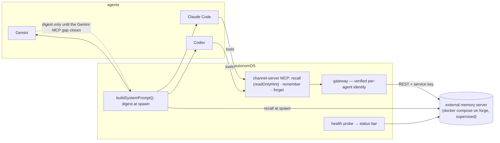

# Addendum 2: adopting an external memory system (2026-09-12)

Terry's frame after the first two documents: *"not really sure if we should build our memory system pivoting around CC's memory… I'm more so considering an EXTERNAL memory system."* This addendum takes **adopt an external system** as the goal and works it up with the same rigor as the custom path. The earlier findings stand as evidence; the verdicts attached to them are re-opened here as engineering questions. The custom path appears in the comparison as one row among peers, not the incumbent.

Locked from earlier rounds: fleet-shared + per-agent scope, direct attributed writes, exact wording preserved for rules. Constraints used to rank the field:

1. Provider-neutral access from Claude Code, Codex and Gemini (MCP, or a REST API we wrap).
2. Self-host preferred (trusted fleet, data on the box); hosted/paid evaluated honestly with cost.
3. Multi-machine (laptop + forge).
4. Longevity: maintainer/company health, license stability, cadence.
5. **Verbatim option**: LLM extraction can be disabled or bypassed per write, and the verbatim text is still searchable.
6. Scoping: per-agent, per-project, fleet.
7. Attribution of writes to a named agent.

One lens shift matters before the table. **autonomOS already owns an MCP surface** (the per-agent channel server with `readOnlyHint` pre-approval on Codex and the per-agent token on the gateway). So "does the vendor ship an MCP server?" is nearly irrelevant: our channel server is the MCP server, and it wraps whatever REST or SDK the backend exposes. What matters is a clean, stable API with a verbatim write, filterable scoping, and a self-hostable server. That lens moves mem0 up (it lost its self-hosted MCP this year but has the cleanest REST) and moves Zep Cloud out (its MCP is human-OAuth only, and there is no self-host below Enterprise).

## 1. The field, re-ranked for our constraints

Sources for every cell are in the re-scan report summarized here and in [`landscape.md`](landscape.md); "unverified" means secondary source only. Hands-on rows are marked ✔.

| Candidate | License | Self-host | API for our shim | Verbatim write | Scoping | Attribution | Multi-machine | Price | Longevity risk |
|---|---|---|---|---|---|---|---|---|---|
| **mem0 OSS** ✔ | Apache-2.0 | `server/` compose: `mem0/mem0-api-server` + pgvector | REST `/memories`, `/search`; `infer` passthrough | **Yes** — `infer=False` stores each message verbatim, embeds, no LLM call (verified: 0.03–0.7 s/add) | flat `user_id`/`agent_id`/`run_id` + free metadata filters, **one call for fleet recall** | `agent_id` + metadata; not enforced by the store (our shim enforces) | one server + API keys | free | **Medium**: open-core drift — graph memory OSS→Platform (~2026-04), `mem0-mcp` archived 2026-03-24, OpenMemory deleted from the monorepo 2026-07-29 (commit `ea2ee075`, verified) |
| **mem0 Platform** | proprietary | no (on-prem = Enterprise) | REST + hosted MCP `mcp.mem0.ai` (bearer key, 11 tools) | **Yes** — `infer:false` "Direct Import", hash-dedup | `user/agent/app/run_id` + projects | same as OSS | SaaS | Hobby free (10k add / **1k retrievals per month**); Starter $19 (50k/5k); Pro $249 (500k/50k, graph, Dream) | Low-medium: lock-in; $24M Series A (2025-10) |
| **Honcho** ✔ | **AGPL-3.0** server, Apache-2.0 SDKs | compose from source: api + deriver + pgvector (+redis); 0.66 GB image, **262 MB RSS** for the API | REST `/v3/`; official MCP (stdio/HTTP, bearer) | **Yes** — `POST /conclusions` stores `content` verbatim as `level=explicit`, embeds, no LLM (verified) | workspace / peer (agent = peer) / session / scope | **Native**: every conclusion carries `observer_id` + `observed_id` (verified) | one server, many clients | self-host free; hosted $100 credits, $2/M tokens ingested, chat $0.001–0.50/query | Low-medium: $5.35M + $13.3M (unverified); rename churn (observations→conclusions in 3.0) |
| **cognee** ✔ | Apache-2.0 | `cognee/cognee` image (Hub tags lag PyPI), compose; SQLite+LanceDB+Kuzu default | REST server + official MCP (`remember/recall/forget/cognify_status`) | **Partial** — `add` is raw and LLM-free, but **nothing is searchable until `cognify`**, which always runs LLM extraction (verified: `NoDataError` before cognify; 14.5 s for 3 facts on a local 7B); verbatim chunks survive and are reachable via `CHUNKS`/`CHUNKS_LEXICAL`, but the high-level `search` returned an LLM one-liner in my second run | datasets + ACLs; per-agent identities via `/agents/create`; MCP auto-scopes by **client name**, not agent | agent rows + API keys (REST) | one server, `COGNEE_SERVICE_URL` clients | OSS free; Cloud $1/M tokens | Low (weekly releases, $7.5M seed 2026-02); API churn (v1 add/cognify/search now "legacy") |
| **Graphiti OSS** | Apache-2.0 | `zepai/knowledge-graph-mcp` (FalkorDB bundled) or Neo4j | MCP only (no REST, **no auth**) | **Mostly** — `add_triplet` never rewrites the fact (LLM only for dedup when related edges exist, which can collapse it); `add_episode` always extracts (#1299 open); server needs an LLM configured to boot | `group_id` | `source_description` on episodes; none on triplets | one MCP server | free | Low-medium: monthly with breaking bumps; same small company as Zep |
| **Zep Cloud** | proprietary | **no** (CE deprecated 2025-04-02; BYOC = Enterprise) | REST SDK; hosted MCP is **OAuth 2.1 via IdP only** — unusable by headless agents (verified by the re-scan) | episodes stored verbatim and searchable; extraction on `graph.add` cannot be disabled | user graphs / standalone graphs / projects | roles + metadata | SaaS | free 10k credits; Flex $125; Flex Plus $375 | Medium-high: ~5 people (unverified); Feb-2026 deprecation wave |
| **LangGraph `PostgresStore`** | MIT (lib); Agent Server Elastic-2.0 + LangSmith license | Postgres | library only; REST store exists only on the licensed Agent Server | **Yes** — `put()` stores JSONB as-is; `index=False` skips embedding | namespace tuples | in the value | one Postgres | lib free | LangMem **stale** (0.0.30, 2025-10); self-host free tier ratcheted down twice; Python-only |
| Hindsight (new) | MIT | single container | HTTP MCP + REST | **No bypass** — `retain` always extracts; raw chunks kept | banks | — | one server | cloud usage-based | Low (23.5k★, weekly) |
| Mnemosyne (new) | MIT | pip, SQLite + sqlite-vec + FTS5 | MCP stdio/HTTP, ~20 tools | **Yes**, byte-identical | banks + global/session, `source` | `source` param | per-machine + `sync-serve` relay (LWW log) — the only one with a **sync story** | free | Medium: created 2026-04, 3.1k★ |
| EverOS (new) | Apache-2.0 | `everos server start`; Markdown + SQLite + LanceDB | REST; MCP path unverified | Markdown-canonical | `user/agent/app/project/session_id` native | native ids | Markdown is git-syncable | free | Low-medium: 12.9k★, v1.3.1 (2026-09-08) |
| agentmemory (new) | Apache-2.0 | npx, SQLite | REST + stdio shim, 54 tools | Yes (BM25 keyless) | project + `AGENT_ID`, shared/isolated | `AGENT_ID` | one server + HMAC | free | **High**: single maintainer, created 2026-02, implausible star growth |
| Supermemory Local | MIT + 10k-doc licence cap | single binary | REST; MCP hosted-only | no (dreams every doc) | container tags | — | one server | hosted $19–399 | young self-host path (0.0.x data-loss patch) |
| Letta | Apache-2.0 | Letta Code local | none first-party | agent-driven | per-agent MemFS | git commits | **shared memory is cloud-only** | $20/mo | re-platformed 2026; Python server EOL |
| Memori, MemOS, Memobase, Redis Agent Memory, MongoDB, A-MEM | various | — | — | — | — | — | — | — | each fails constraint 2 or 5 outright (hosted extraction, mandatory OpenAI key, unmaintained, or preview-only) |
| **Custom** (README Phase 1) | ours | `$configDir/memory` | our own | yes by construction | fleet/project/agent | gateway token | file sync / rsync | free | ours to maintain |

## 2. What the new hands-on runs settle

All three ran in the isolated scratchpad (Ollama on `127.0.0.1:11435`, Docker on `127.0.0.1:18000`/`15432`/`16379`), then were torn down. Details and numbers in [`hands-on.md`](hands-on.md) §§3, 8–9.

- **mem0 `infer=False` is a real verbatim primitive.** The rule text came back byte-for-byte with our `scope`/`author` metadata attached; no LLM call; search 0.02 s. So the paraphrase/duplicate/contradiction problems seen in the first spike are a *per-write choice* (`infer=True`), not a property of mem0. The remaining cost of inferred mode is unchanged and is Terry's to weigh.
- **cognee cannot serve a verbatim rule without an LLM pass first**, and its ingest step even probes the LLM before accepting data. With a capable API model that is a ~1–3 s, fractions-of-a-cent step per write; with a local 7B it was 14.5 s for three facts and produced 500s on the way. Verbatim chunks do exist after cognify, but reaching them reliably means using its lower-level retrievers, not the top-level `search`.
- **Honcho self-hosts in one `docker compose up` (26 s build, three containers), stores conclusions verbatim with native `observer_id`/`observed_id`, and found "3100" by the number alone** (embedding-only, no BM25 — it still ranked the right conclusion first). Two integration wrinkles: the schema defaults to 1536-dim OpenAI vectors and needs its `configure_embeddings.py --yes` script for any other embedder; and **`conclusions/query` requires both `observer` and `observed` filters**. A fleet-wide "what do we know about X?" is therefore not one call: either every agent writes fleet facts under a convention peer (losing native attribution in the observer slot) or our shim fans the query out across known observers.

## 3. Integration designs for the top three

Common shape for all three, because it is the same shape the custom path used. What differs is what the shim talks to.

- **Where it runs.** One instance on **forge** (always on), as a supervised `docker compose` unit alongside the autonomOS service (launchd/systemd, ADR-050 pattern). The laptop's autonomOS reaches it over the existing private network path, never a local port tunnel. The store's service key lives in `$configDir/settings.json` like the other server-side secrets; agents never hold it, which is how attribution stays honest: the **channel server** sets `agent_id`/`observer_id` from the gateway-verified session, so an agent cannot write as another agent even though the backend itself would allow it.
- **`remember`** → verbatim write by default (`infer=False` / `conclusions` / raw `add`), with `scope ∈ {agent, project, fleet}` mapped to the backend's fields; an optional `infer: true` flag exposes the backend's extraction when an agent wants consolidation rather than a rule.
- **`recall`** → the backend's search with the caller's scopes; results carry author + timestamp so readers can weigh them. The **spawn-time digest** is a `recall` of the agent's own scope + its project scope, rendered into `buildSystemPrompt` (which is also the only path to Gemini today).
- **Failure modes.** If the server is unreachable: `recall`/`remember` return a plain "memory unavailable" tool error (never a fabricated empty result); the digest falls back to the **last successful digest cached on disk** per agent (`$configDir/memory-cache/<agent>.md`) with a "stale as of <time>" line; the status bar shows the probe red; `remember` is **not** queued for replay (a replayed write hours later is worse than a lost one — the agent is told it failed and can retry). Backup = the compose volume; restore = the vendor's own Postgres, which is the one piece Terry does not have to write or maintain.

### 3a. mem0 OSS server (recommended external backend)

- **Runs:** `mem0/mem0-api-server` + `pgvector/pgvector:pg17` (the vendor compose). Bundled providers only: LLM openai/anthropic/gemini, **embedders openai/gemini** — so an OpenAI or Gemini key is required for embeddings unless the image is rebuilt with Ollama (a `requirements.txt` + `main.py` edit; documented by the re-scan). Pin `mem0ai==2.0.20` and the `server/` directory at a commit.
- **Mapping:** `remember(scope, text)` → `POST /memories {messages:[text], agent_id:<caller>, user_id:<"fleet"|"project:
"|caller>, infer:false, metadata:{scope, author, project}}`. `recall(query, scope?)` → `POST /search {query, filters:{user_id…}}`. Fleet recall is one call. `forget` → `DELETE /memories/{id}`.
- **Why it ranks first under Terry's frame:** the largest, most active project in the field (65k★, $24M, 2–3 releases a month) with the cleanest verbatim write and one-call scoped recall, the same `infer:false` semantics on the **hosted Platform**, so "self-host now, pay later (or the reverse)" is a URL and key change in one place, and a Claude Code / Codex / Gemini integration ecosystem already exists for the Platform. The OSS churn is real but has landed entirely in features this design does not use (graph memory, their MCP servers).
- **Honest costs:** an embedding API key (or an image rebuild for Ollama); the store trusts whatever `agent_id` it is handed (enforcement is ours); OSS no longer hash-dedups raw writes, so the shim should dedup by exact text within scope.

### 3b. Honcho (recommended if Terry wants the reasoning layer)

- **Runs:** api + pgvector (+deriver +redis if the derived-insight layer is wanted). Verified booting with Ollama embeddings after the dimension script. AGPL-3.0 imposes nothing on a single-user control plane that is not distributed with it.
- **Mapping:** each agent is a **peer**; `remember(scope:"agent")` → conclusion `observer=caller, observed=caller`; `remember(scope:"project")` → `observer=caller, observed="project:
"`; recall of one's own scope is one query; **project/fleet recall needs a fan-out** over known observers (the agent list is one `list_agents` away) or a convention peer. Attribution is native and filterable.
- **What you get that mem0 lacks:** `peer.chat()` (Dialectic) answers natural-language questions about a peer with an LLM at a chosen reasoning level, the deriver turns raw session messages into typed conclusions in the background, and "Dreaming" consolidates — i.e. the extraction layer exists but is **off by default and separate from the verbatim path**, which is the cleanest split in the field.
- **Honest costs:** five services if everything is on; embedding-only recall (no BM25) for conclusions; the pair-scoped query; rename churn between majors.

### 3c. cognee (only if graph-shaped knowledge is the goal)

- **Runs:** one container with SQLite + LanceDB + Kuzu, plus an LLM endpoint it will call on every write. Official MCP exists, but our shim would still front it for attribution (cognee's MCP scopes by client name; real per-agent identities are a REST-side `/agents/create`).
- **Mapping:** `remember` → `add` + `cognify` (LLM); `recall` → `search(CHUNKS_LEXICAL|CHUNKS)` for verbatim, `GRAPH_COMPLETION` for synthesized answers.
- **Honest costs:** every write is an extraction call; no verbatim-without-LLM path; the API is mid-rename ("legacy" add/cognify/search vs remember/recall/forget). Strong if the ask becomes "what supersedes what, and how do these facts connect", weak as a rules store.

### Paid path in one paragraph

**mem0 Platform** is the only hosted option that a headless fleet can actually use (bearer-key MCP and REST, `infer:false`). Hobby's 1,000 retrievals/month is too small for agents that recall at every spawn; Starter ($19, 5k retrievals) fits a small fleet; Pro ($249) is where graph memory and Dream live. Zep Cloud's MCP is human-OAuth only and Zep has no self-host tier; Supermemory's hosted MCP has no Gemini path and its local binary has a licence cap; cognee Cloud is usage-priced but the OSS tier already does everything we need. Data leaves the box on every write and read with any hosted option, which the trusted-fleet model tolerates but the README's security note does not endorse.

## 4. The earlier disqualifiers, re-opened honestly

| Objection in the README | Is it an engineering problem or a verdict? |
|---|---|
| *LLM extraction paraphrases rules, duplicates, misses contradictions* | **Engineering: solved by the verbatim modes** (mem0 `infer=False`, Honcho conclusions, Graphiti `add_triplet`, LangGraph `put`). Extraction becomes opt-in per write. Terry's real trade is then: keep extraction available as a tool for consolidation (mem0 Dream / Honcho deriver) versus never paying for it. cognee and Hindsight cannot be made verbatim. |
| *OSS tiers are a moving floor* | **Engineering, mostly:** pin versions and images (`mem0ai==2.0.20`, Honcho `v3.1.2`, `graphiti-core==0.30.2`) and stay on the REST/SDK core; the 2026 removals hit graph tiers and vendor MCP servers, which this design does not depend on. What pinning cannot fix: a future license change (Zep already did it to CE; Honcho is AGPL today) — mitigated by the fact that all three keep data in plain Postgres you can walk away with. |
| *Retrieval is trivial, so a platform adds little* | **True but incomplete.** What Terry buys is not retrieval; it is a maintained server with its own migrations, backups, dashboard (mem0 ships one; Honcho has an SDK), and an ecosystem of integrations, plus an extraction layer when he wants it. "Maintained by someone else" is a legitimate value the custom path cannot offer. |
| *Multi-machine sync* | **Nobody replicates.** Every candidate's answer is "one server, point both machines at it", which is also what the custom path would do with a file sync. Only Mnemosyne has a peer sync mechanism, and it is a young project. If laptop↔forge parity means *working offline on the laptop*, no external candidate provides it; if it means *one shared brain*, all of them do. |
| *Python runtime / extra service* | **Unavoidable with any external system** — every viable candidate is a Python server in a container. The cost is one supervised compose unit on forge, which is a known pattern here. |

## 5. Claude Code's native auto-memory in an external-system world

Briefly, because it is no longer the centerpiece:

- **Leave it alone (default recommendation).** It stays a Claude-Code-local convenience keyed by repo. Our digest and tools are the shared brain; anything an agent wants the fleet to know goes through `remember`. Cost: the two can disagree; Claude Code agents may "remember" something into the local dir that Codex never sees. This is the status quo.
- **Disable it at spawn** (`CLAUDE_CODE_DISABLE_AUTO_MEMORY=1` in the agent env): one store, but Claude Code's automatic capture is lost and the 134 existing files stop growing.
- **One-way export**: a periodic job reads each project's Claude Code memory dir (our `titleCache` already knows the path) and `remember`s new or changed facts into the project scope, attributed to "claude-code-native". Cheap, no sync engine, and it turns the automatic capture into a feed rather than a competitor. This is the only bridge that survives Terry's objection, because the system is complete without it.
- **Seeding**: whichever backend is chosen, the 134 files import in one script as verbatim writes into `project:autonomOS` with `author=claude-code-native` and the original `modified` timestamps.

## 6. Recommendation under Terry's frame

**Adopt mem0 OSS, self-hosted on forge behind our channel server, with verbatim writes as the default and the hosted Platform as the zero-ops fallback.** Rationale in three lines: it is the only candidate that combines a clean verbatim write, one-call scoped recall, the healthiest project, and an identical API on a paid tier; the churn that made it look risky in the first pass is in features this design does not touch; and our channel server supplies the MCP surface, attribution and Codex/Gemini reach that mem0 itself no longer ships.

**Choose Honcho instead if** Terry wants the built-in reasoning layer (Dialectic questions, background derivation, dreaming) and accepts AGPL, a heavier compose, and a fan-out for fleet recall. Honcho was the most convincing thing I booted this round.

**Choose cognee only if** the goal becomes a knowledge graph over code and decisions rather than a rules-and-lessons store.

Phase 1 under this frame (M, 1–2 weeks): compose unit + supervision on forge; `recall`/`remember`/`forget` in the channel server (the same four-place tool recipe as before, plus the committed `dist.mjs` rebuild); digest at spawn with the cached-digest fallback; health probe in the status bar; import script for the 134 files; ADR recording "external backend behind our shim, verbatim by default, backend swappable at one call site". Phase 2: the one-way Claude Code export, and switching `infer` on for a "consolidate" tool if Terry wants it.

**Questions for Terry**
1. mem0 (rec) or Honcho as the backend? Or "run both for a week behind the same shim" — the shim design makes that a settings toggle.
2. Embeddings: an OpenAI/Gemini key for the vendor image as shipped, or rebuild for local Ollama?
3. Hosted fallback: is the mem0 Platform Starter tier ($19) acceptable as the no-ops path, or is data-on-the-box a hard rule?
4. Extraction: verbatim-only forever, or expose `infer: true` as an explicit "consolidate" tool?
5. Claude Code native memory: leave alone, disable at spawn, or one-way export?
6. Does "multi-machine" mean one shared server (all candidates) or offline laptop use (none of them)?
