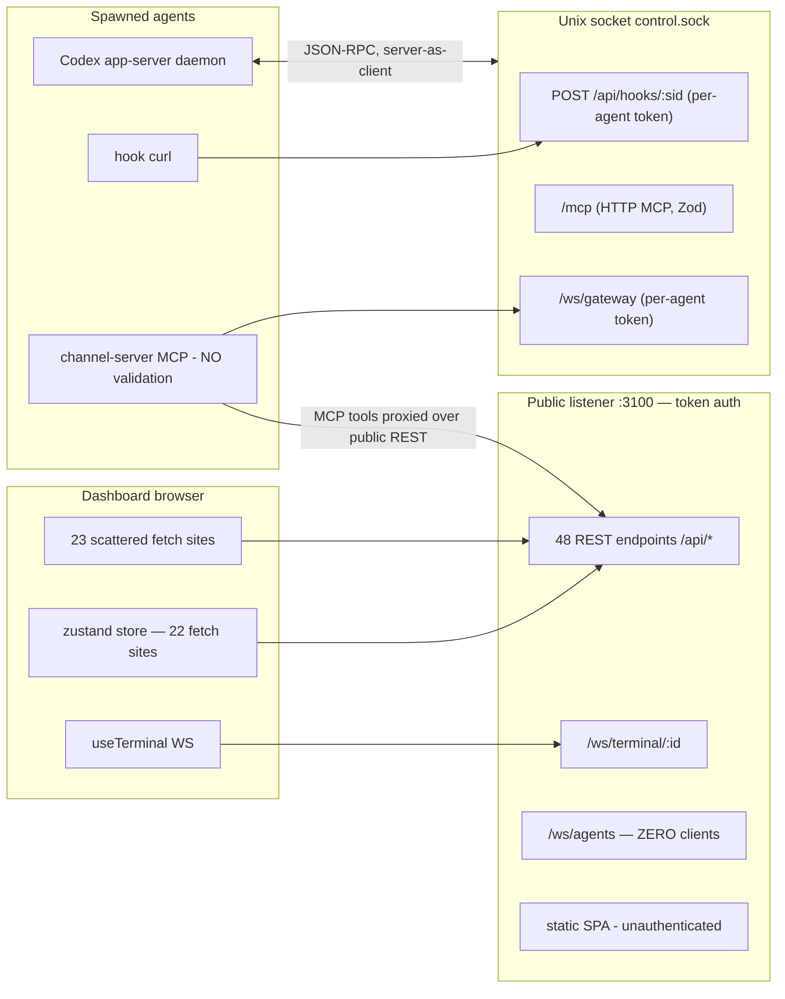

# Dashboard/Gateway API Consolidation — Audit & Proposal

**Date:** 2026-08-08 · **Author:** APIConsolidation@autonomOS · **Status:** PROPOSED — awaiting Terry's approval (propose-pause)
**Basis:** clean checkout at `e23e60a` (main HEAD), audited by four parallel exploration agents (REST, dashboard call sites, WebSocket surfaces, gateway/MCP).

Terry's brief: *"Our dashboard/gateway has a mix of different API calls. I'd like a complete refactor, improvement, and alignment in terms of naming, efficiency, and functionality."*

---

## Part 1 — Current-state map

### 1.1 Topology

Two Hono apps (`run.ts:215` public TCP, `:225` internal Unix socket per ADR-055):

- **48 public REST endpoints** across 11 route families; **3 WS channels**; **2 MCP transports**; the gateway router.
- The channel-server (every spawned agent's tool surface) **proxies most MCP tools over the public REST API**; the HTTP MCP (internal socket) calls domain functions directly. Same operations, two handler implementations.

### 1.2 REST endpoint inventory (48 public + internal)

| Family | Endpoints | Notes |
|---|---|---|
| auth/host | `POST /auth`, `GET /api/host` | `/auth` is the only non-`/api` path; `/api/host` the only auth-exempt endpoint (CLI status probe; leaks hostname+build id) |
| `/api/agents` (10) | `GET /`, `GET /tree`, `GET /:id`, `POST /`, `PATCH /:id`, `POST /:id/manager`, `POST /:id/attach`, `DELETE /:id`, `POST /:id/kill`, `POST /restart-all` | agents.ts is 975 lines; `DELETE` is a ~420-line hand-rolled reparent transaction; only router with `onError` |
| `/api/hooks` (1 internal + 5 public) | ingest `POST /:sid` (internal); reads: `GET /`, `GET /notifications`, `GET /:sid/status`, `GET /:sid/notifications`, `POST /:sid/read` | named for mechanism, not resource (it's agent status + notifications); in-memory only; `/:sid/status` never 404s |
| `/api/schedules` + `/api/scheduler` (9) | CRUD + `run` + `runs`; `scheduler/status`, `scheduler/settings` | two mounts differing by one char; `scheduler/settings` writes the same AppSettings store as `/api/settings` |
| `/api/env-presets` (5) | CRUD + `GET /:name` | only surface accepting secret values (ADR-067) |
| `/api/templates` (4) | CRUD | only router that returns `warnings[]` for accepted-but-ignored input |
| `/api/settings` (2) | `GET /`, `PUT /` | whitelist-and-discard, silent legacy remaps |
| small read-only | `providers`, `channels/status`, `projects`, `plugins/claude-usage`, `plugins/codex-usage`, `system/version` | providers probes binaries per-request uncached; projects does an uncached 256KB-tail-scan per session |
| `/api/usage-queue` (4) | `GET /`, `POST /_simulate` (env-gated), `POST /:sid`, `DELETE /:sid` | `:sid` resolution is id-only unchecked cast — name-arming 404s unlike every other agent route |
| system | `POST /api/system/upgrade` | **zero callers** — CLI runs `performUpgrade` in-process |

### 1.3 Dashboard client layer — there isn't one

- **45 raw `fetch()` calls + 1 raw `WebSocket`. No wrapper, no axios/react-query/SWR.** 22 calls live as zustand store actions; 23 are scattered across components/hooks/plugins.
- **Six error-handling idioms** coexist, from silent `.catch(() => null)` swallows (a 500 is indistinguishable from "no change") to `CreateAgentPanel.tsx:75` which never checks `res.ok` at all.
- **Four cancellation mechanisms** (AbortController ×2, closure flag, ref, nothing). Store actions have none — an unmount-race `set()` is always possible.
- **No in-flight dedup**: `fetchSessions` fires from 8 triggers; concurrent `GET /api/agents` responses can land out of order.
- **Typing**: `Agent` — the most-used response — is hand-duplicated as an inline anonymous type (`store.ts:778-794`) instead of importing core's `Agent`. `OrgNode` is declared independently in dashboard and server. ~10 responses flow as effectively `any`.
- **Auth**: works everywhere *by accident* — same-origin httpOnly cookie. No seam for a future cross-origin thin client (PWA #71): 45 call sites would each need a header.
- Duplicate independent fetches: `/api/agents/tree` (two hooks, two 5s timers, divergent error handling + cache policy), `/api/settings` (2 GET + 4 PUT sites, no cross-invalidation — two panels can display contradictory settings), `/api/host` (×2), `POST /api/hooks/:id/read` (store + panel fan-out with full refetch).

### 1.4 Polling vs push — the headline inefficiency

**The server has a fully-built agent-delta push channel (`/ws/agents`: `reconcile` snapshot + typed `AgentDelta` stream, 20 emit sites) with ZERO dashboard consumers.** Meanwhile:

| Poll | Interval | Push already available? |
|---|---|---|
| `/api/hooks` (agent status + unread) | **3s** | **No** — status is the one thing `AgentDelta` doesn't model (no `agent.status` variant); `setAgentStatus` mutates a map and emits nothing |
| `/api/agents` | **5s** | **Yes — byte-identical** (`reconcile` sends the same `listAgents()`) |
| `/api/agents/tree` ×2 (two hooks) | **5s each** | **Yes** — tree derives from `managerId`; `agent.reparented` exists for exactly this |
| schedules+status, templates, env-presets | 10s | no push exists |
| usage-queue | 15s | no push exists |
| projects | 30s | no push exists |
| host health | 2s/20s adaptive | deliberately poll (liveness probe) |
| usage plugins | 60s | genuinely poll-shaped (external APIs) |

~60 req/min steady-state with just the sidebar; ~91 req/min with panels open. **No poll is gated on `document.visibilityState`** — a backgrounded tab polls at full rate forever. This is the roadmap's standing "Tier 2 perf — replace polling with gateway WebSocket push" item.

### 1.5 WS channels — four protocols, zero shared conventions

| | terminal | agents | gateway | codex app-server |
|---|---|---|---|---|
| discriminator | none inbound / `type` | `type` | `type` | JSON-RPC `method`/`id` |
| naming | `resize` | `agent.created` (dotted past) | `send_result` (snake verb) | `turn/start` (slash) |
| timestamp | none | **none** | only in `GatewayMessage` | none |
| correlation | none | none | `requestId` | numeric `id` |

- WS plumbing (registry, parse, broadcast, eviction) is hand-rolled three times; `sessionClients` names two different things in two files.
- `AgentDelta` has no timestamp — a reconnecting client can't order or judge staleness.
- No heartbeat on any channel; terminal reconnect has no jitter (lockstep stampede after a server restart).
- `dashboard_connect` on `/ws/gateway` is **unreachable by construction** since ADR-055 moved the endpoint to the Unix socket (browsers can't dial `ws+unix://`) — yet `fanOutToDashboard` still runs per routed message.

### 1.6 Three tool surfaces, two handler implementations per operation

- **Channel MCP** (what every spawned agent uses): low-level MCP `Server`, **no schema validation at all** — `inputSchema` is advertised but never enforced; proxies to public REST.
- **HTTP MCP** (internal socket): `McpServer.tool()` with Zod; calls domain functions directly, **bypassing REST validation/error-mapping/side-effects**.
- **REST**: **zero Zod anywhere**; hand-rolled `typeof` checks; HTTP status recovered by **substring-matching thrown error messages** (order-dependent, with caller text interpolated into matched strings).

Concrete divergences this produced: `create_agent({permissionMode:"yolo"})` rejected over HTTP MCP, accepted (fallback+warn) over the channel path; `list_agents` has three implementations with three shapes and two filters, and both MCP descriptions claim a `workingDirectory` field neither returns; `get_org_chart` omits the `provider`/`permissionMode` fields that the REST tree added *specifically for external MCP clients*; `forkFrom`'s agent-facing description says "Claude session ID" when it's an agent id; the cron re-register rule is written twice. Only `MCP_INSTRUCTIONS ↔ ALL_TOOLS` is drift-guarded; nothing checks the two schema sets against each other — which is exactly how these survived.

### 1.7 Consistency defects (REST)

- **Seven error envelope shapes** (`{error}`, `{error,code,retryable}`, `{error,detail}`, `{error,currentVersion}`, `{error,children}`, the 7-field DELETE shape, `{status:"error",message}`). Success shapes equally divergent.
- **Creates disagree**: agents/env-presets → 201; schedules/templates → 200.
- Only `agentsRouter` has `onError`; no `app.onError`/`notFound` → unhandled throws are bare Hono 500s, and **the 404 shape differs between dev and prod**.
- Two optimistic-concurrency mechanisms in one file (`If-Match` header vs `version` in body).
- `POST /:id/manager` is semantically a PUT; CLAUDE.md still documents it as `PUT /api/org/manager` (doc drift).
- Naming: `/api/scheduler` vs `/api/schedules`; `/api/hooks` named for mechanism; `/auth` outside `/api`; file naming `env-presets.ts` vs `usageQueue.ts`.
- Three agent-resolution helpers used inconsistently; only one detects duplicate-name ambiguity.
- `asStringRecord`/`asStringArray` in env-presets **silently drop** malformed values (200 with keys missing) — same accepted-but-ignored class the templates router explicitly guards against with `warnings[]`.

### 1.8 Dead surface

| Item | Status |
|---|---|
| `PATCH /api/agents/:id` | no caller, no test |
| `POST /api/system/upgrade` | no caller (CLI bypasses in-process) |
| `GET /api/agents/:id`, `GET /api/hooks/:sid/status`, `GET /api/hooks/:sid/notifications`, `GET /api/env-presets/:name` | no first-party caller |
| `dashboard_connect` + `dashboardClients` + `fanOutToDashboard` | unreachable by construction post-ADR-055 |
| `platform:"slack"` hardcoded on every agent message (`router.ts:222`) | vestige of ADR-064-deleted adapters |
| `clearAgentState`/`clearNotifications` | called only from tests → hook state never reclaimed; `GET /api/hooks` returns ids no longer in the store |

### 1.9 Functionality gaps

- Dashboard cannot **reparent** or **edit** an agent (the routes exist; `HierarchyPanel` tells the user to use MCP `set_manager`).
- Unread notification counts are not in any push shape.
- Duplicate agent names are silently tolerated by two of three resolvers.
- Scheduler messages arrive from sender `"Agent schedule"` (literal `"scheduler"` string sliced as if a UUID).

---

## Part 2 — Proposed target design

### 2.1 Conventions (to be codified as an ADR at implementation time)

1. **Paths**: everything under `/api`; resources are plural kebab-case nouns; actions are `POST /api/<resource>/:id/<verb>` (kill, attach, run, read — legitimized and documented, not eliminated). `/auth` → `POST /api/auth` (auth-exempt like `/api/host`). `/api/scheduler/*` folds into `/api/schedules/status` + `/api/schedules/settings` (schedule-name validation reserves `status|settings|runs`). `/api/hooks` **read** family renamed to its resources: `GET /api/agent-status` (bulk), `GET /api/notifications`, `POST /api/notifications/:sessionId/read`. Hook **ingest** keeps `/api/hooks/:sessionId` on the internal socket (it really is about hooks, and agents' baked settings reference it).
2. **One error envelope**: `{error, code, retryable?, details?}` — the shape `agents.ts` already has, promoted to both apps via `app.onError` + `app.notFound` + typed Error subclasses (kills substring-sniffing; consistent JSON 404 in dev and prod). Extra fields (`currentVersion`, `children`, rollback detail) move under `details`.
3. **One success convention**: mutations return the resource; pure actions return `{ok:true, ...}`; creates return **201**; accepted-but-ignored input always reports `warnings[]` (templates' pattern, generalized).
4. **One validation source**: Zod schemas per operation live in `mcp/tools.ts`'s successor (a shared `api/schemas` module), consumed by REST (`zValidator`), HTTP MCP, **and the channel server** (validate before dispatch). JSON-Schema for `ALL_TOOLS` is *generated* from the Zod source, so tool schema ↔ REST schema drift becomes impossible (fixes the class behind the `list_agents`/`forkFrom`/deprecation-label divergences). Note: `mcp/tools.ts` must stay core-import-free (bundling constraint) — the shared schema module lives inside `server/src` and is bundled into the channel server the same way.
5. **One resolver**: agent lookup by id-or-name with duplicate-name ambiguity detection (today's `resolveAgentId` semantics), used by REST, both MCPs, and usage-queue.
6. **One concurrency mechanism**: `version` in body (drop `If-Match`).
7. **WS envelope convention** (new channels + `/ws/agents` only — terminal protocol untouched): `type` dotted past-tense events, flat payload + `ts` timestamp; document it in the ADR. Add `ts` to `AgentDelta`.

### 2.2 Dashboard API client layer (`packages/dashboard/src/api/`)

A typed client — not a framework adoption:

- `api/core.ts`: `request()` with error normalization to a typed `ApiError` (parses the unified envelope; `code`/`retryable` surfaced), `AbortSignal` plumbed everywhere, **in-flight GET dedup** (same-URL concurrent requests share one promise), and a single base-URL/credentials seam (unblocks cross-origin PWA later).
- One module per family (`api/agents.ts`, `api/schedules.ts`, …) with **response types imported from `@autonomos/core`** — wire types (`Agent`, `OrgNode`, `AgentStatusMap`, `NotificationFeed`, `HostInfo`, `ProviderInfo`, `MaskedSettings`, `QueueSnapshot`) move to core so server and dashboard share one declaration.
- All 45 call sites migrate; store actions consume the client; the 6 error idioms collapse to: queries set typed error state, mutations throw `ApiError`.
- A small **poll manager** generalizing `useUsageQueue`'s proven pattern (module-level ref-counted `useSyncExternalStore` + change-only commit), with **`visibilityState` gating** — backgrounded tabs stop polling.

### 2.3 Push migration (the Tier 2 roadmap item)

1. Add **`agent.status`** to the `AgentDelta` union; emit from the `setAgentStatus` chokepoint (covers hook ingest + Codex daemon feed). Add unread-count changes (either an `agent.notifications` delta or fold count into `agent.status`).
2. Dashboard connects to **`/ws/agents`** (shared reconnect helper with backoff + jitter): retires the 5s `/api/agents` poll, both 5s `/api/agents/tree` polls (tree derives client-side from the flat list — also kills the `?k=` cache-buster and the duplicated hook), and the 3s `/api/hooks` poll. REST stays as the reconcile/fallback path.
3. Polls that remain: usage plugins (60s, external APIs), host liveness (by design), and the 10-15s panel polls (schedules/templates/presets/usage-queue) — now visibility-gated; a later `config.changed` delta could retire them, but that's not this initiative.
4. Net effect: steady-state request rate drops from ~60-91 req/min to **~2-5 req/min** + one WS.

### 2.4 Server consolidation

- **Service layer**: one shared function per operation (the REST route body today), called by REST *and* HTTP MCP — kills the duplicated template/manager/permissionMode pre-processing, the twice-written cron re-register rule, and the `emitAgentDelta`-only-on-some-paths class. Channel MCP keeps proxying REST (correct: it's remote), but **validates first**.
- **Secrets guard moves into `envPresets.ts`** (storage boundary) instead of three call-site conventions (guard-placement lesson, ADR-067).
- **Dead-surface removal**: `dashboard_connect`/`dashboardClients`/`fanOutToDashboard`, `GET /api/hooks/:sid/*` singles, vestigial `platform` field. ~~`POST /api/system/upgrade`~~ — **withdrawn 2026-08-08**: ReleaseRollout@autonomOS's rollout initiative is actively reviving this handler (their PR-1 swaps its install-mode resolution); the zero-caller state was a symptom of the unreachable-upgrade bug they're fixing, not abandonment. Their lane owns it. (Also agreed with ReleaseRollout: `GET /api/system/version` keeps its path and `{version, platform, arch}` fields byte-for-byte; their badge fields `{latest, updateAvailable, checkedAt}` are additive — to be encoded in the conventions ADR.) `PATCH /api/agents/:id`: **deleted** per Terry's decision (rename/reparent UI is a feature for later, not consolidation). `GET /api/agents/:id` and `GET /api/env-presets/:name` stay (standard REST reads, usable by external clients).
- **Hook-state reclamation**: wire `clearAgentState`/`clearNotifications` to agent delete (kill keeps state; delete reclaims).
- **Efficiency**: cache `providers` binary probe (TTL), mtime-cache `/api/projects`, bound `runs?limit`.
- Fix scheduler sender URI (`scheduler` pseudo-name rendered honestly, not `"Agent schedule"`).

### 2.5 Breaking changes — honest list

| Change | Who breaks | Mitigation |
|---|---|---|
| Route renames (`/auth`, `/api/scheduler/*`, hooks-read family) | **Running agents' channel-servers** spawned before the deploy (they proxy old REST paths and live until respawn); any personal scripts/Nox tooling | **Compat aliases for one release** (old paths dual-mounted, logged as deprecated), removed the release after. Channel-server + CLI updated in lockstep (same repo) |
| Error envelope unification | Anything parsing the seven shapes | The dashboard client layer lands *first* and reads both old + new envelopes during transition |
| Zod on REST (400s where silent-drop/fallback was) | Channel-server callers sending malformed input that today "works" | This is the *point* — but staged after the client layer so the dashboard surfaces the new errors properly |
| 200→201 on creates | Callers checking `res.status === 200` | Audit shows all first-party callers check `res.ok` |
| `If-Match` removal | Nobody (PATCH has zero callers today) | — |
| Hook ingest path | **Unchanged** — baked into running agents' settings; not touched | — |

### 2.6 Coordination boundary with TerminalRender

- **We do not touch**: `/ws/terminal/*` server handler, `useTerminal.ts`, frame coalescing, buffer persistence, the terminal protocol (including its known warts — no heartbeat, JSON-sniff ambiguity, no jitter — all documented above and *handed over*, not fixed here).
- **We add**: a dashboard WS-reconnect helper (backoff + jitter + visibility handling) for the `/ws/agents` client. TerminalRender may adopt it later **if they choose** — we will not migrate `useTerminal` onto it.
- **Shared file risk**: `run.ts` (WS mounting) and `Sidebar.tsx` (their buffer-persistence work may touch pane switching; our poll removal touches its timers). Proposed rule: we sequence PR 5 (push migration) after their coalescing PR merges, or coordinate via TeamLead if timelines cross.

---

## Part 3 — Staged PR plan

Each slice: `/polish` → `/qa` (real spawn against isolated instance) → exact CI → QA-ready stop → **Terry visual-QA via vite proxy** (`VITE_API_PORT=3100 bunx vite` on a free port) → squash-merge.

| PR | Content | Size | Risk | Visual QA focus |
|---|---|---|---|---|
| **0. Usage correctness quick-fix** (Terry-approved 2026-08-08) | Shared effective-utilization selector (bar + queue agree on window set, capping window disclosed in both UIs); `stale_token` in queue auth-error set; single-flight coalescing on both scanners; stale data served *with* an error/stale marker instead of silent re-serve or bar blanking; fix wrong TTL comment + append ADR-068 correction | S | Low | bar shows capping window; button + bar agree at threshold |
| **1. ADR + dead-surface removal** | API-conventions ADR; delete `system/upgrade`, `dashboard_connect` plumbing, hooks-read singles, `platform` vestige; fix scheduler sender name; wire hook-state reclamation on delete | S | Low | none visible (regression sweep) |
| **2. Dashboard API client layer** | `src/api/` typed client; migrate all 45 call sites; unified errors/cancellation/dedup; poll manager + visibility gating; wire types into core | L | Med (touches every panel) | every panel behaves identically; errors now visible where they were swallowed |
| **3. Server error + validation unification** | typed errors, `app.onError`/`notFound` both apps, Zod via shared schemas on REST, 201s, `warnings[]` generalized, single resolver, single concurrency mechanism | M | Med | error toasts/states across panels |
| **4. Tool-surface consolidation** | HTTP MCP → shared service functions; channel-server validates `ALL_TOOLS` (generated schemas); secrets guard into storage; fix `list_agents`/`get_org_chart`/`forkFrom`/deprecation-label divergences; drift tests | M | Med | none visible (agent-facing; QA = real agent spawn exercising tools) |
| **5. Push migration** | `agent.status` (+unread) delta; `/ws/agents` dashboard client (reconnect helper w/ jitter); retire 3s/5s/5s×2 polls; client-side tree derivation | M | Med-High | live status icons, org chart, sidebar under agent churn; reconnect after server restart. **Sequenced after TerminalRender's coalescing PR** |
| **6. Route renames + compat aliases** | `/api/auth`, `/api/schedules/{status,settings}`, `/api/agent-status` + `/api/notifications`; channel-server/CLI lockstep; deprecated aliases logged; CLAUDE.md/docs sync | M | Low-Med | full smoke pass; alias hit-log empty before next-release removal |

Order rationale: the client layer (2) lands early so every later server-side change has exactly one place to absorb it; validation (3) before consolidation (4) so services are built on the typed-error foundation; renames last because they're the only externally-breaking slice and ride behind aliases.

## Part 4 — Usage bar vs usage queue (Terry's follow-up, 2026-08-08)

Terry observed the usage bar at 87% while the usage-queue button armed at 90%. Traced end-to-end (fifth audit agent):

**Root cause — window sets, not staleness.** Both UIs call the same server functions (`getRateLimits()`/`getCodexUsage()`) and read the same module-level caches; they cannot disagree on a value. They disagree on **selection**: the status bar renders only `fiveHour` + `sevenDay` (`UsageStatusBarItem.tsx:437,440`); the queue's cap is `max()` over **four** windows including `sevenDaySonnet`/`sevenDayOpus` (`usageQueue.ts:357`; Codex adds `additionalLimits[]`, `:377-379`) against `CAP_ENTER = 90` (`usageQueue.ts:54`). A per-model weekly window ≥90% arms the queue while the bar truthfully shows 5h at 87%. The per-model windows render only inside the expanded panel.

**Real staleness problems found alongside** (secondary, but worth fixing):
- Worst-case display age: Claude bar **240s** (180s server TTL + 60s client poll), queue button 195s; Codex 120s/75s; a 429 pins values for 5 min.
- **Unbounded staleness under sustained upstream failure**: `lastGood` is re-cached every cycle with no max age and no error flag (`scanner.ts:457-463`) — the bar shows a frozen number that looks live.
- No in-flight coalescing on either scanner → multi-tab thundering herd at TTL boundaries → elevated 429 risk (which then pins for 5 min).
- `usageQueue.ts:59-60` comment and ADR-068's rationale claim a 60s Claude cache; it has been **180s** since #264.
- Claude `stale_token` missing from the queue's auth-error set (`usageQueue.ts:362`) — an expired token leaves armed panes holding silently; Codex handles it (`:369`).
- No `visibilitychange` refetch; one failed poll blanks the Claude bar to "–" for up to 60s.

**Proposed remediation (pending Terry's slice decision):**
1. **Quick correctness PR (small, early):** shared "effective utilization" selector in one place so bar and button agree on the window set (bar shows the max-window percentage, or at minimum the button/bar disclose *which* window is capping); add `stale_token` to the queue's auth-error set; single-flight coalescing on both scanners; cap `lastGood` re-serve age + surface staleness in the bar; fix the wrong TTL comment.
2. **Usage → push (folds into PR 5):** move the probe loop server-side (one timer per provider instead of N-tabs × polls) and emit a `usage.updated` delta over `/ws/agents` — bar and button then move in the same frame, client polls retire, and the thundering herd disappears structurally.

## Part 5 — Decisions (Terry, 2026-08-08, direct in-session)

1. **Hooks-read renames** → **APPROVED**: rename to `/api/agent-status` + `/api/notifications` behind one-release compat aliases.
2. **`PATCH /api/agents/:id`** → **DELETE as dead** (TeamLead's recommendation; a rename/reparent UI is a feature, not consolidation — re-add when the need is real).
3. **Panel polls** → visibility-gated / on-demand polling for config resources; **usage data raised separately** — see Part 4 (Terry's 87%-vs-90% observation), remediation slice decision pending.
4. **PR 5 sequencing after TerminalRender's coalescing PR** → **APPROVED**.
